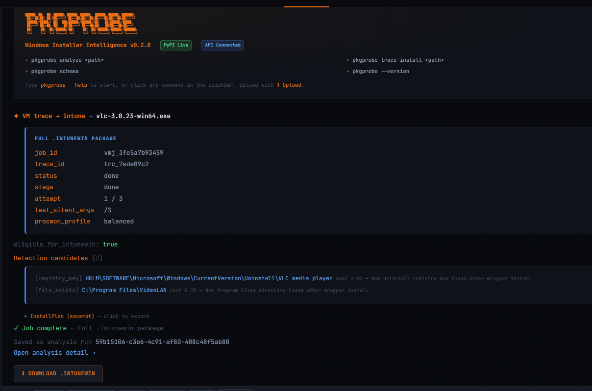

## pkgprobe


**pkgprobe** is a Windows installer intelligence toolkit for endpoint teams.

It combines:
- **static analysis** (`pkgprobe analyze`) for fast, no-exec prediction of
  silent install commands, detection rules, and uninstall guidance
- **optional runtime verification** (`pkgprobe-trace`) that executes installers
  in disposable VMware snapshots, captures ProcMon-backed system changes, and
  generates verified outputs (including `.intunewin` packaging artifacts)

Think: reliable package intelligence for Intune, SCCM, Jamf, RMM, and Client
Platform Engineering workflows.

Available on [PyPI](https://pypi.org/project/pkgprobe/).

**[Full usage documentation](docs/USAGE.md)** — Commands, options, output formats, and trace-install behavior.

**Trace + Intune packaging (VMware ProcMon trace → verified manifest → `.intunewin`)**:
**[Full trace/intunewin documentation](docs/TRACE-INTUNE.md)**.

------------------------------------------------------------------------

## ✨ Why pkgprobe exists

Packaging software on Windows is still more art than science:

-   Silent install flags are undocumented or inconsistent
-   Installer technologies vary widely (Inno, NSIS, InstallShield, Burn,
    etc.)
-   Detection rules are often copied, guessed, or discovered via
    trial-and-error
-   Testing installers directly is slow and risky on production machines

**pkgprobe** is static-first by design:

> Understand what an installer is likely to do before execution, then
> optionally verify behavior in an isolated VM when confidence needs to be
> production-grade.

------------------------------------------------------------------------

## What it does (v0.3)

Given an `.msi` or `.exe`, pkgprobe outputs a structured **install
plan** containing:

### Installer intelligence

-   Detects installer type (MSI, Inno Setup, NSIS, InstallShield,
    WiX Burn, Squirrel, MSIX/AppX Wrapper)
-   Confidence-scored classification with structured evidence trail
-   Preflight probes (help screen, 7-Zip listing) promote detection
    when byte-level markers alone are insufficient
-   Family explainability: see which families were considered and
    why the winner was chosen

### Deployment assessment

-   **Packaging tier** classification: Simple, Pro, or Auto-Wrap
-   **Deployment risk** rating (Low / Moderate / High)
-   **Actionable next steps** based on detected difficulty
-   Separate from family identification --- the same family can
    have different deployment viability depending on confidence

### Command inference

-   Probable silent install commands, ranked by confidence
-   Family-specific uninstall commands (Inno, NSIS, InstallShield,
    Burn, Squirrel, MSIX/AppX, and generic fallbacks)
-   Evidence explaining why each command was suggested

### Detection guidance

-   MSI ProductCode-based detection (when available)
-   Family-aware detection rules: registry ARP checks, `file_exists`
    for installer-specific uninstallers, registry key for Burn bundles,
    PowerShell `Get-AppxPackage` for MSIX/AppX
-   Follow-up guidance for improving detection accuracy
-   Designed to integrate cleanly into Intune / SCCM detection logic

### Automation-friendly output

-   JSON output suitable for pipelines and tooling
-   Clean CLI summary by default; `--verbose` for full detail tables
-   Internal analyzer telemetry (`--telemetry`) for diagnostic logging

### Static analyze (MSI-first, then EXE)

-   **MSI** is classified first and gets predictable `msiexec` guidance.
    Includes deployment assessment and packaging tier.
-   **EXE** adds optional preflight on Windows (`/?` help, **7-Zip** listing for nested `.msi` / Squirrel / `setup.ini` hints). InstallPlan includes `silent_viability`, `recommendation`, deployment risk, and packaging tier; when silent is unreliable, the tool steers you toward **VM trace** instead of more silent-flag guesses.

### Optional runtime trace + packaging

-   `pkgprobe-trace run` executes installers in a disposable VMware VM
    snapshot and captures ProcMon trace data
-   **Guest readiness** uses `vmrun checkToolsState` polling (bounded wait)
    instead of a fixed sleep; optional extra delay via `--boot-wait`
-   **Diff quality:** built-in filters drop common VM/ProcMon noise (VMware
    Tools paths, trace tooling, noisy processes); optional **installer PID
    tree** filtering (ProcMon `PID` / `Parent PID`); optional **baseline CSV**
    subtraction (idle VM capture) to remove boot/OS noise
-   **Reliability:** `vmrun` retries on failed copy/guest operations
-   **Performance:** copy PML to the host first and export CSV with
    `--host-procmon` (local `procmon.exe`) instead of exporting only in the guest
-   **Debugging:** `--pause-after` skips the cleanup snapshot revert so you can
    inspect the VM
-   Writes **`trace_contract.json`** (install plan + raw diff) for upstream
    services and a **draft** `verified_manifest.json` (local preview only;
    **authoritative** eligibility + Intune packaging gating runs on
    **api.pkgprobe.io**)
-   `pkgprobe-trace pack-intunewin` can build `.intunewin` only with
    **authoritative** verification (from the cloud API trace flow) or via
    unsafe `--allow-unverified` / `--community-pack` for local experiments

**Safety-first by design**\
Default `pkgprobe analyze` is still **static analysis only** (no execution).\
Runtime execution is opt-in and isolated in a disposable VM workflow.

------------------------------------------------------------------------

## Example

``` powershell
pkgprobe analyze .\setup.exe
```

Default output (clean summary):

```
  Installer: Inno Setup               Confidence: High
  Deployment Risk: Low

  Recommended next step:
  -> Try silent install: "setup.exe" /VERYSILENT /SUPPRESSMSGBOXES /NORESTART /SP-

  Packaging tier: Simple
  (Well-known silent switches; high detection confidence)

  Wrote: installplan.json
```

Add `--verbose` (`-V`) for full detail tables (evidence, all candidates,
detection rules, notes, alternatives):

``` powershell
pkgprobe analyze .\setup.exe --verbose
```

Generated `installplan.json` (excerpt):

``` json
{
  "installer_type": "Inno Setup",
  "confidence": 0.92,
  "deployment": {
    "silent_viability": "likely",
    "deployment_risk": "low",
    "recommended_next_step": "auto_package",
    "packaging_tier": "simple",
    "tier_reason": "Well-known silent switches; high detection confidence",
    "suggested_command": "\"setup.exe\" /VERYSILENT /SUPPRESSMSGBOXES /NORESTART /SP-"
  },
  "install_candidates": [
    {
      "command": "\"setup.exe\" /VERYSILENT /SUPPRESSMSGBOXES /NORESTART /SP-",
      "confidence": 0.88
    }
  ]
}
```

Runtime trace + manifest example:

```powershell
pkgprobe-trace run .\setup.exe `
  --vmx "C:\VMs\TraceVM\TraceVM.vmx" `
  --snapshot TRACE_BASE `
  --guest-user Administrator `
  --guest-pass "..." `
  --output "C:\traces\job-001" `
  --silent-args /S `
  --emit-manifest
```

Optional flags (see [docs/TRACE-INTUNE.md](docs/TRACE-INTUNE.md)): for example
`--baseline-csv` (subtract an idle trace), `--host-procmon` (export PML→CSV on
the host), `--vmrun-retries`, `--pause-after`, `--guest-tools-timeout`.

Successful VMware trace + Intune packaging run (wrapper-fallback with strong
detection anchors):



------------------------------------------------------------------------

## Installation

### From PyPI (recommended)

``` powershell
pip install pkgprobe
pkgprobe --version
pkgprobe analyze .\setup.exe --out installplan.json
```

### From source (development)

This project uses **uv** for fast, reproducible Python environments.

``` powershell
pip install uv
git clone https://github.com/Zeph3r/pkgprobe.git
cd pkgprobe
uv venv
uv sync
uv run pkgprobe --help
```

Use `--quiet` / `-q` to suppress the banner when scripting (CI,
pipelines, etc.).

For runtime tracing and Intune packaging setup, see:
- [docs/TRACE-INTUNE.md](docs/TRACE-INTUNE.md)

------------------------------------------------------------------------

## Supported inputs

  File type     Status   Notes
  ------------- -------- -----------------------------------------------------
  MSI           ✅       Metadata parsed via Windows Installer APIs
  EXE           ✅       Heuristic detection via string & signature analysis
  MSIX / AppX   🔍       EXE wrapper detection + PowerShell guidance

### EXE installer families detected

  Family            Byte markers     Preflight (7z)   Install switches   Uninstall   Detection rules
  ----------------- --------------- ---------------- ------------------ ----------- ----------------
  NSIS              ✅               —                ✅                  ✅           file_exists
  Inno Setup        ✅               —                ✅                  ✅           file_exists
  InstallShield     ✅               —                ✅                  ✅           ARP registry
  WiX Burn          ✅               ✅                ✅                  ✅           registry_key
  Squirrel          ✅               ✅                ✅                  ✅           file_exists
  MSIX/AppX Wrapper ✅               —                ✅                  ✅           powershell

------------------------------------------------------------------------

## How detection works

pkgprobe combines:

-   Static string extraction (ASCII + UTF-16LE) for six installer families
-   PE overlay / structural heuristics (NSIS payload detection)
-   Optional preflight probes (help screen, 7-Zip listing) that promote
    detection when byte markers alone are ambiguous
-   Heuristic confidence scoring (0–1, deterministic)
-   Evidence tracking (matched strings, metadata clues, preflight hints)

This keeps analysis **fast, safe, and explainable**.

------------------------------------------------------------------------

## Current limitations

-   Windows-first (intentional --- this targets Windows endpoints)
-   EXE analysis is heuristic-based (not guaranteed)
-   Runtime tracing currently targets VMware Workstation-based Windows
    workers (cloud worker backends are future architecture)
-   `pkgprobe-trace` requires guest preparation (VMware Tools, ProcMon,
    baseline snapshot)
-   Trace diffs are **heuristic** (ProcMon CSV); PID-tree and baseline options
    improve signal but are not a substitute for full process-tree replay

------------------------------------------------------------------------

## Roadmap

### v0.3.0 (current)

-   Packaging tier classification (Simple / Pro / Auto-Wrap)
-   Deployment risk assessment per family
-   Clean default CLI output with `--verbose` for detail
-   Internal analyzer telemetry (`--telemetry`)
-   Family explainability (evidence, alternatives considered)
-   Burn confidence conservatism, Squirrel output nuance
-   MSIX/AppX early branching with native deployment guidance
-   MSI deployment assessment and tier

### Next

-   Cloud API at `api.pkgprobe.io` (analyze, trace, auto-wrap)
-   Self-serve billing (Stripe) with tier-based gating
-   CLI cloud commands (`pkgprobe cloud-wrap`, `pkgprobe upgrade`)
-   install4j / Java-based installer detection
-   Partial-read scanning for very large EXEs
-   Queue-native multi-job orchestration for trace + packaging

------------------------------------------------------------------------

## Who this is for

-   Client Platform Engineers
-   Endpoint / EUC Engineers
-   Intune / SCCM / Jamf admins
-   Security teams validating installer behavior
-   Anyone tired of guessing silent install flags

------------------------------------------------------------------------

## Philosophy

pkgprobe is intentionally conservative.

It prefers:

-   Explainability over magic
-   Confidence scoring over certainty
-   Safety over speed

If it can't be confident, it tells you *why*.

That's how real platform tooling should behave.

------------------------------------------------------------------------

## License

MIT
